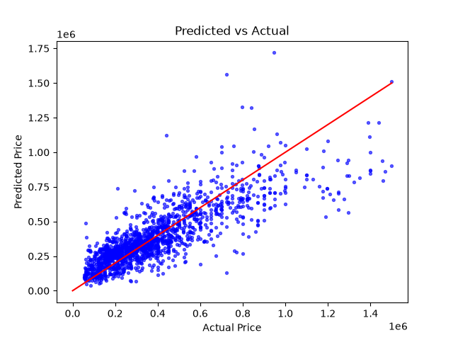

# Edmonton Housing Price Predictor 🏠

Multivariable linear regression predicting Edmonton house prices from four
features, with gradient descent implemented from scratch.

## Quick Start

```bash
pip install -r requirements.txt
python src/main.py
```

## Data

Edmonton housing listings from [Kaggle](https://www.kaggle.com/datasets/dilshaansandhu/edmonton-neighborhood-and-housing-data). After cleaning:
1653 houses.

**Features:** square footage, bedrooms, bathrooms, year built

**Target:** listing price

Rows were dropped for missing values, prices at or above $1.5M, square
footage outside 300–6000, year built before 1900, and bedroom counts
outside 1–8.

## Method

`src/model.py` comprises of the machine learning: z-score normalization,
squared-error cost function, the gradient, and the gradient descent loop.

`src/main.py` loads and cleans the CSV, trains the model, and plots the
results.

Features are z-score normalized to make them share a common scale and allow 
for a single learning rate to converge the weights.

Trained for 500 iterations at a learning rate of 0.01.

## Results


Cost falls from 1.04e+11 to 1.03e+10 and flattens by roughly iteration 250,
confirming convergence.

| Feature | Weight |
|---|---|
| Square Footage | 140,139 |
| Bedrooms | 59,722 |
| Bathrooms | 29,818 |
| Year Built | -50 |

Weights are in normalized units. For example, square footage's 140,139 means a house one standard deviation larger than average with the other three features unchanged is worth $140,139 more.

Square footage is the most impactful factor as expected, at more than twice the weight of the second strongest feature. Bedrooms and bathrooms both contribute meaningfully on top of it, demonstrating that even after accounting for total size, how that space is divided still moves the price, and bedrooms matter about twice as much as bathrooms. Year built came out at negligible. I believe that this suggests older homes tend to sit in central neighbourhoods, resulting in a higher price whereas the newer ones are further out. The two effects likely cancel in a model that can't see where a house is.



Each point is one house. The x-axis is the house's actual price while the y-axis is the price that the model predicted. The red line marks a perfect prediction, while a dot above the line means the model over-predicted, and a dot below means the model under-predicted the price.

## Limitations

- Average error is roughly ±$100k on a mid-range house.
- The model tends to underpredict above ~$900k, visible from the points under red line at the right. A linear model assumes a
  constant price per square foot, but real-world prices exhibit an exponential behaviour as price increases.
- **Location is not a feature.** This is the largest omission I have made. Identical
  houses in different Edmonton neighbourhoods differ by a considerable amount in
  price, and the model cannot see that.
