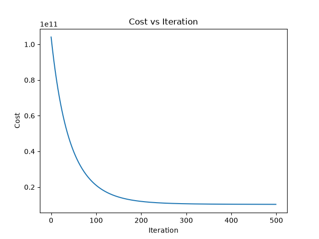

# Edmonton Housing Price Predictor

Multivariable linear regression predicting Edmonton house prices from four
features, with gradient descent implemented from scratch.

## Quick Start

```bash
pip install -r requirements.txt
python src/main.py
```

## Data

Edmonton housing listings from [Kaggle](https://www.kaggle.com/datasets/dilshaansandhu/edmonton-neighborhood-and-housing-data). After cleaning:
1653 houses.

**Features:** square footage, bedrooms, bathrooms, year built

**Target:** listing price

Rows were dropped for missing values, prices at or above $1.5M, square
footage outside 300–6000, year built before 1900, and bedroom counts
outside 1–8.

## Method

`src/model.py` comprises of the machine learning: z-score normalization,
squared-error cost function, the gradient, and the gradient descent loop.

`src/main.py` loads and cleans the CSV, trains the model, and plots the
results.

Features are z-score normalized to make them share a common scale and allow 
for a single learning rate to converge the weights.

Trained for 500 iterations at a learning rate of 0.01.

## Results



